## Rでプレゼンテーション作成


1. まず[Rをインストール](http://cran.ism.ac.jp/)
2. 続いて[RStudioをインストール](http://www.rstudio.com/ide/)
3. それぞれダウンロードしたらダブルクリックしてインストール


--- 
## RStudioを起動

FileメニューからR Presentatin を選択

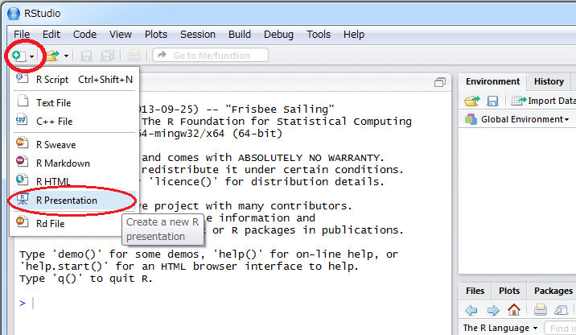

ファイル名を尋ねられるので test とか適当に
(ファイル名は半角英数字をお勧めします)

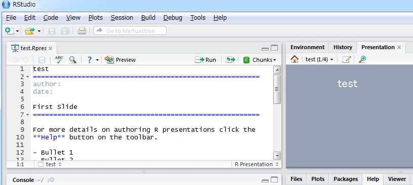

--- 
## プレビューを観る

とりあえずpreviewを押して

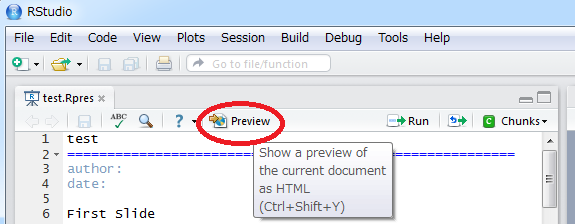

ここを押すと、作成されるイメージが確認できます

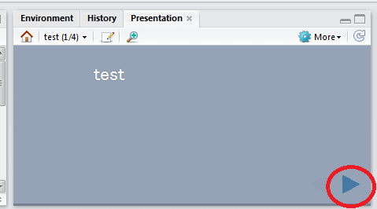

--- 
## プレビューを観る2

また拡大アイコンを押すと、新たにウィンドウが現れます

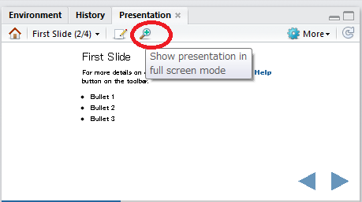

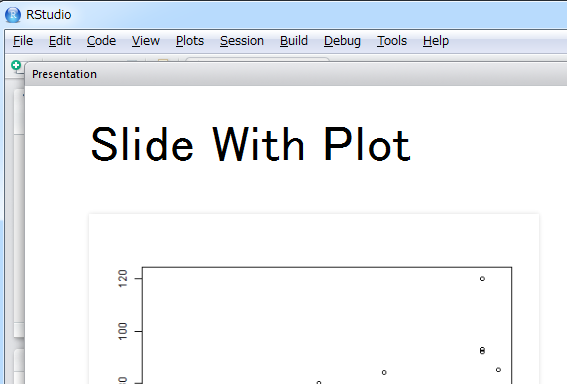


--- 
## スライドを作成する

それでは雛形を修正していきましょう(RStudioは日本語入力に少し難があります)

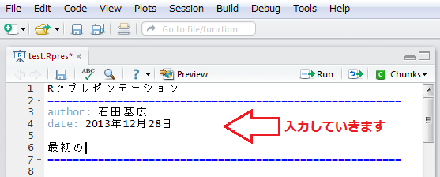

ここで再びpreviewボタン押して、右Presentationタブを操作してみます

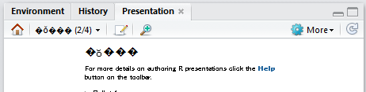

Macの場合、問題ないと思いますが、Windows環境だと文字化けしてしまいます

<!-- これは次のように修正します -->

--- 
## Windows環境での文字化け修正


Fileメニューから save with Encoding を選択

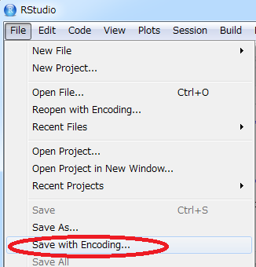

 
ダイアログでUTF-8を選んでOK。previewを実行すると文字化けが解消されます

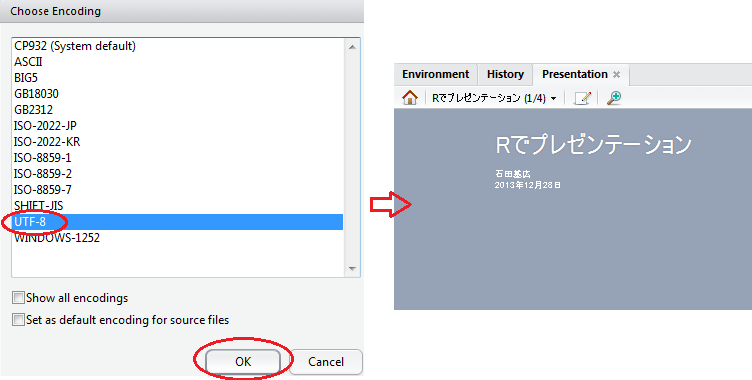

--- 
## R Presentationの書き方1

Markdownという書式で記述します

詳細はヘルプで確認できます(ただし英語です)

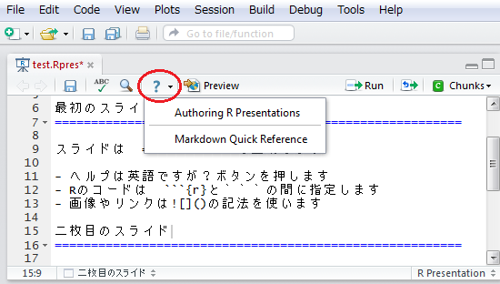

Authorizing R Presentation はRStudio上での使い方

Markdown Quick Reference はMarkdown記法の説明

---

## R Presentationの書き方2

とりあえず次のルールを覚えましょう

1. スライドは =============== で区切る
2. Rの命令は ```` ```{r} 改行 ``` ```` の間に書く 
3. リンクや画像は`[]()`という記法を使う

たとえば以下のように書くと次のスライドができます

    iris とは
    ===============
    iris データの散布図
    ```{r,fig.height=5} `r ''`
    plot(cars)
    ```
    [irisについて](http://ja.wikipedia.org/wiki/Iris)


---

## iris とは

iris データの概要と散布図

```{r,fig.height=5}
plot(Sepal.Length ~ Sepal.Width, data = iris)
```

[irisについて](http://ja.wikipedia.org/wiki/Iris)

---


## 任意の画像を挿入する

自前で用意した画像を挿入するには

    

という書式を使います


<!-- ## コードチャンクそのものを表示させる -->

<!--     iris とは -->
<!--     =============== -->
<!--     iris データの散布図 -->
<!--     `r ''````{r,fig.height=5} `r ''` -->
<!--     plot(cars) -->
<!--     ``` -->
<!--     [irisについて](http://ja.wikipedia.org/wiki/Iris) -->


<!-- 
(shell-command "Rscript ~/Dropbox/R/Kyoritsu/IntroStats2/slides/misaki2.R")
-->
